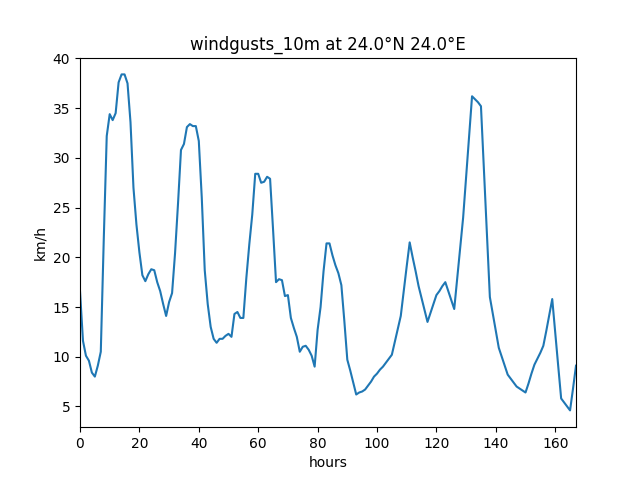

# Caseoppgave
This is a script that extracts weather data from the Open-Meteo API and plots it as a graph.

## Prerequisits
To run the code, you need to install the following python packages:

```
requests
argparse
matplotlib
```
You can install these packages by running

```
pip install -r requirements.txt
```

Or by manually installing them with `pip install`

## Open-Meteo API
The code uses data from the Open-Meteo API. A link to their API can be found here: https://open-meteo.com/en/docs.

## How to use the program
You need to run the code directly from the command-line interface (CLI). It can be run by typing:

```
python main.py [latitude] [longitude] [category]
```

`[latitude]` is a float value between -90 and 90 \
`[longitude]` is a float value between -180 and 180 \
`[category]` is a string that selects which weather data to display. Currently the program the following categories from the API:

```
temperature_2m - Air temperature at 2 meters above ground
windspeed_10m - Wind speed at 10 meters above ground
windspeed_80m - Wind speed at 80 meters above ground
windspeed_120m - Wind speed at 120 meters above ground
windspeed_180m - Wind speed at 180 meters above ground
winddirection_10m - Wind direction at 10 meters above ground
winddirection_80m - Wind direction at 80 meters above ground
winddirection_120m - Wind direction at 120 meters above ground
winddirection_180m - Wind direction at 180 meters above ground
windgusts_10m - Wind gusts at 10 meters above ground
soil_temperature_0cm - Temperature in the soil at 0 cm 
soil_temperature_6cm - Temperature in the soil at 6 cm 
soil_temperature_18cm - Temperature in the soil at 18 cm 
soil_temperature_24cm - Temperature in the soil at 24 cm 
```
You can also get information by running `python main.py -h` or `python main.py --help` in your command line. \
More detailed information can be found in the documentation of the API: https://open-meteo.com/en/docs.

An example of how it can be run with different inputs:

Output of `python main.py 25.2 10 temperature_2m`
<p align = "center">

</p>

Output of `python main.py 3.2 4.5 windspeed_10m`:
<p align = "center">

</p>

Output of `python main.py 24 24 windgusts_10m`
<p align = "center">

</p>

Output of `python main.py 50 29 soil_temperature_18cm`
<p align = "center">

</p>


